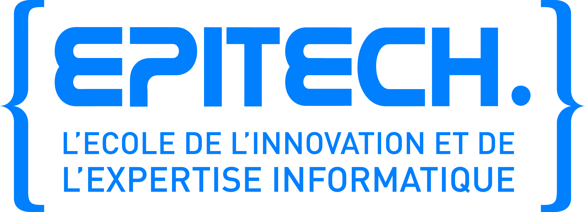

# Skills
-	Knowing how to talk about one's motivation and interests
-	Understanding how a company works and what's at stake 
-	Adapting to the company's environment and knowing how to get organized  
-	Developing a professional attitude: listening, precision, punctuality, following directions
